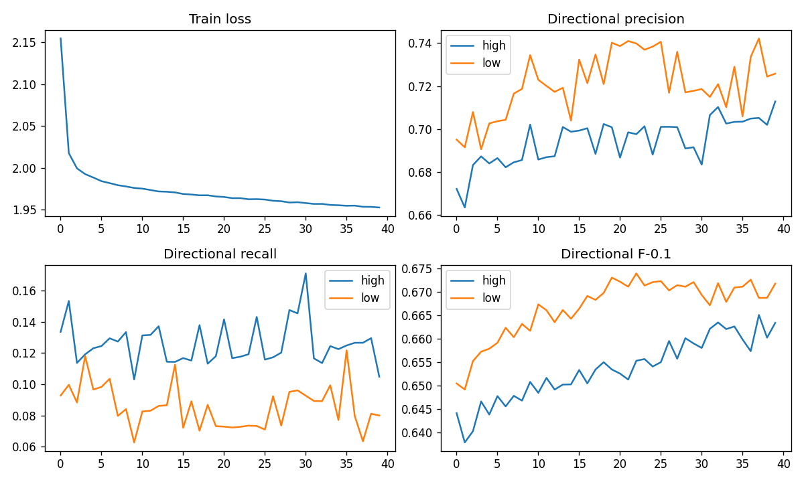
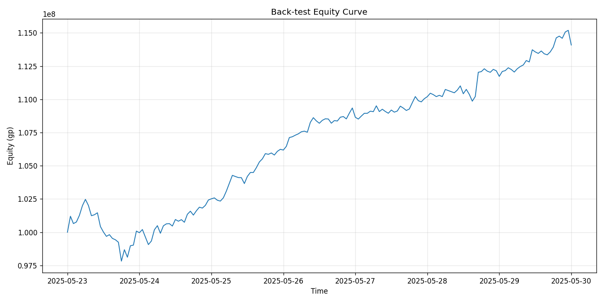

# Old School RuneScape — Item Price Prediction

Forecasting Old School RuneScape (OSRS) Grand Exchange prices from historical trade data, with data collection, modeling, and simulation artifacts included.

> This repository contains:
> - A data collection script that pulls historical price/volume from the OSRS Wiki/Weird Gloop API.
> - A modeling + simulation notebook with training outputs and backtests.
> - Result images in `prediction_model/` for quick viewing in the repo UI.

---

## Repository Layout

```
historical_1h_data/           # Collected (hourly) time-series snapshots (examples/checkpoints)
prediction_model/             # Plots & figures produced by the modeling notebook (embedded below)
API Data Collector.py         # Script to fetch OSRS price/volume history
Modelling & Simulating.ipynb  # End-to-end modeling, training, and simulation
requirements.txt              # Python dependencies
worthwhile_items.txt          # Seed list of items/IDs of interest
LICENSE                       # Apache-2.0
README.md
```

---

## Data Source

I use the OSRS Wiki prices service (via Weird Gloop API), which aggregates real trades (partnered with RuneLite) and exposes historical and latest time-series endpoints.

- OSRS Wiki Price Portal: https://prices.runescape.wiki/
- Weird Gloop API: https://api.weirdgloop.org/

> Please be courteous to the API: include a descriptive `User-Agent` and avoid excessive request rates.

---

## Quick Start

### 1) Environment

```bash
# Python 3.10+ recommended
python -m venv .venv
# Windows: .venv\Scripts\activate
# macOS/Linux:
source .venv/bin/activate
pip install -r requirements.txt
```

### 2) Collect Data

The collector pulls historical price/volume for the items you specify (see `worthwhile_items.txt`) and writes hourly series under `historical_1h_data/`.

```bash
python "API Data Collector.py"
```

### 3) Train / Simulate

Open the notebook and run it end-to-end:

```bash
jupyter notebook "Modelling & Simulating.ipynb"
```

- The notebook contains the full workflow (loading data, preprocessing, model training, evaluation, and trade simulation/backtest).
- Result plots are exported into `prediction_model/` for convenient viewing in the repo.

---

## Modeling Overview

- **Framing:** Time series forecasting on OSRS Grand Exchange price (and volume) with rolling windows.
- **Features:** `high_return_1h`, `low_return_1h`, `high_return_6h`, `low_return_6h`, `vol_ratio`, `low_volume_return_1h`, `high_volume_return_1h`, `volatility_6h`, `volatility_24h`, `hour_sin`, `hour_cos`, `wday_sin`, `wday_cos`, `no_buys`, `no_sells` (with `hour_*`/`wday_*` as cyclical time encodings).
- **Targets:** 3-hour‑ahead **direction** (up/down) classification for each item.
- **Metrics:** Classification metrics (e.g., accuracy, precision, recall, F1) and strategy/backtest metrics where applicable (e.g., cumulative return, max drawdown). Training curves are logged in `prediction_model/training_curves.png`.
- **Artifacts:** Learning curves, validation plots, one-step-ahead predictions, residual diagnostics, and example backtests.

> See the notebook for exact architecture, hyperparameters, and experiments; all plots used in the README are saved under `prediction_model/`.

---

## Results & Figures

<p align="center">
  
</p>

<p align="center">
  
</p>

---

## Reproducing Results

1. Execute the notebook cells in order (they are designed to be self-contained).
2. Plots and tables will be saved under `prediction_model/`; metrics are displayed inline in the notebook.  
   (You can run the collector and adjust the date ranges in the notebook to use more recent data.)

Exact bit-for-bit reproducibility on GPU isn’t possible in PyTorch because some CUDA/cuDNN operations are nondeterministic

---

## Configuration / Customization

- **Item universe:** Edit `worthwhile_items.txt` to add/remove items.
- **Data cadence:** The repository uses **hourly** history; adjust the collector and notebook if you want 5-minute or daily aggregates.
- **Windows/horizons:** Tune lookback window and forecast horizon in the modelling cells.
- **Train/test splits:** Adjust split dates or proportions directly in the notebook.

---

## Known Limitations

- Sudden content updates or economy interventions can shift time series regimes.
- Realized PnL depends on trade frictions (tax, slippage) not fully captured by naive backtests.

---

## License

Apache-2.0. See [`LICENSE`](LICENSE).

---

## Acknowledgements

- OSRS Wiki prices API & Weird Gloop team for making historical and real-time data accessible.
- RuneLite partnership allowing for a real-time feed.
